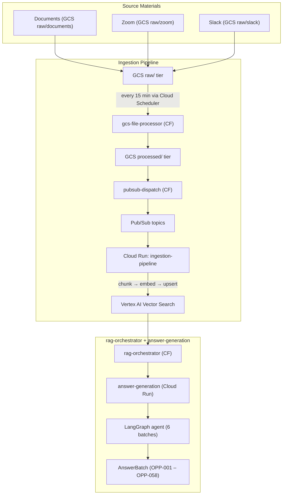
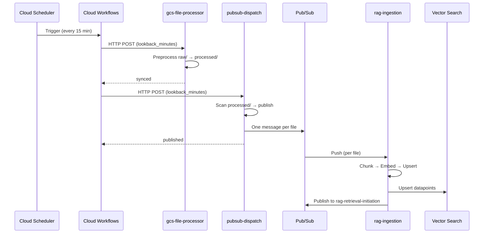
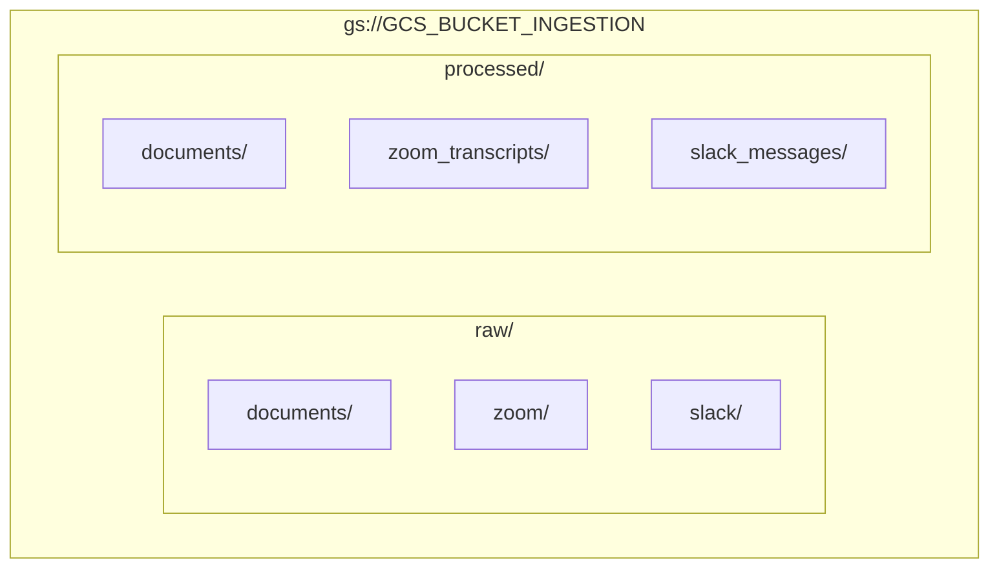
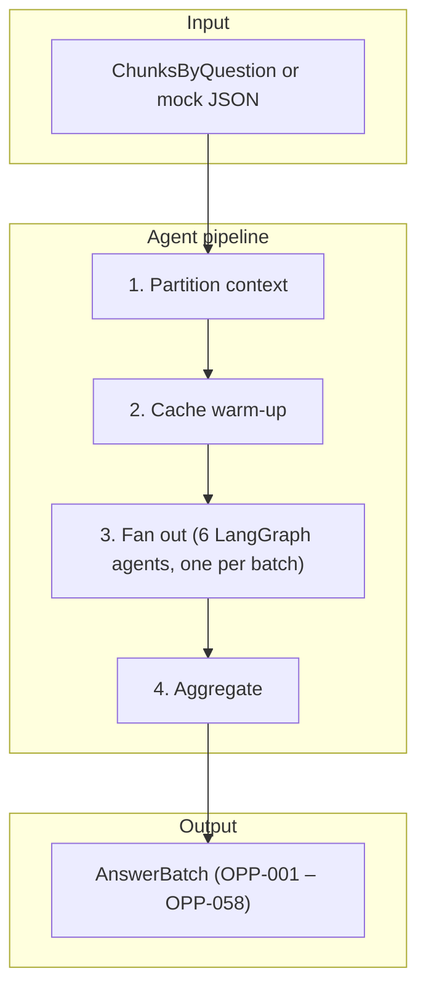
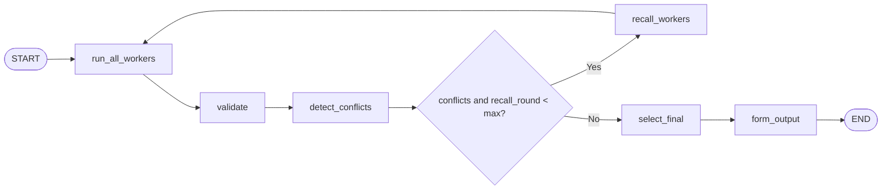
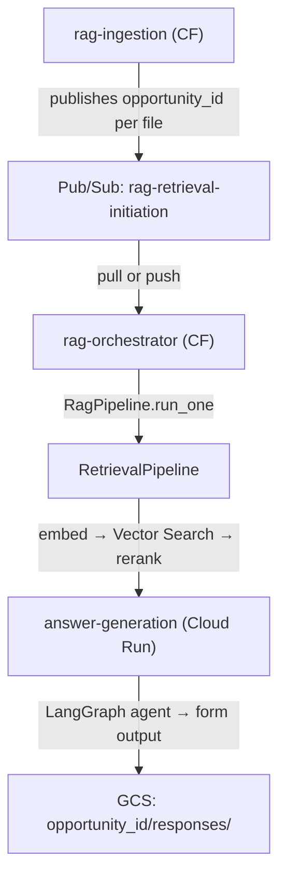

# Knowledge-Assist — SASE Opportunities Sales Agent

[](https://www.python.org/downloads/)
[](https://fastapi.tiangolo.com/)
[](https://docs.astral.sh/uv/)

A FastAPI application that automates SASE opportunity requirements extraction for sellers. It ingests source materials (documents, Zoom transcripts, Slack messages) uploaded directly to GCS, preprocesses and chunks them, embeds them into Vertex AI Vector Search, and runs a parallel LLM pipeline (Gemini 2.5 Flash) to answer all 58 opportunity questions with conflict detection and source attribution.

**Quick links:** [Ingestion Deployment](docs/ingestion-pipeline-deployment.md) · [Answer Generation Deployment](docs/answer-generation-cloud-run.md)

---

## Table of Contents

- [Architecture overview](#architecture-overview)
- [Directory structure](#directory-structure)
- [Data flow](#data-flow)
- [Configuration](#configuration)
- [GCP credentials](#gcp-credentials)
- [Setup](#setup)
- [API reference](#api-reference)
- [Triggering workflow and RAG](#triggering-workflow-and-rag)
- [Related documentation](#related-documentation)

---

## Architecture overview



Documents, Zoom, and Slack files are uploaded directly to GCS at `raw/documents`, `raw/zoom`, and `raw/slack`. The ingestion workflow (gcs-file-processor → pubsub-dispatch) processes them every 15 minutes. The agent side (answer-generation Cloud Run) is decoupled and can be invoked independently via HTTP POST.

**Ingestion sequence:**



---

## Directory structure

```
.
├── main.py                         # FastAPI app entrypoint (uvicorn)
├── pyproject.toml                 # Dependencies (uv)
├── Dockerfile                     # Cloud Run deployment
├── configs/
│   ├── settings.py                # Pydantic-Settings classes (app, logging, LLM, ingestion, retrieval, agent)
│   ├── .env.example               # Non-sensitive config template
│   └── secrets/
│       ├── .env.example           # Sensitive credentials template
│       └── .env                   # Gitignored: GOOGLE_APPLICATION_CREDENTIALS, etc.
├── data/                          # Test data, schema, output
│   ├── test/                      # Sample Zoom VTT, Slack JSON
│   └── sase_sd_schema.sql        # SASE schema reference
├── functions/                     # Cloud Function (gen2) entrypoints
│   ├── gcs_file_processor.py      # HTTP trigger → preprocess raw/ → processed/
│   ├── pubsub_dispatch.py         # HTTP trigger → publish processed/ files to Pub/Sub
│   ├── rag_ingestion.py           # Pub/Sub push trigger → IngestionPipeline.run_message()
│   ├── rag_orchestrator.py        # HTTP/Pub/Sub → RagPipeline (retrieval + answer-generation)
│   └── answer_generation.py      # Cloud Function entry point for answer-generation
├── workflows/
│   └── ingestion_pipeline.yaml    # Cloud Workflows DAG (chains gcs-file-processor, pubsub-dispatch)
├── logs/                          # Rotating log files
└── src/
    ├── apis/
    │   ├── deps/                  # Shared FastAPI dependencies (DB, auth)
    │   └── schemas/               # Request/response Pydantic schemas
    ├── services/
    │   ├── agent/                 # Opportunities Q&A orchestrator
    │   │   ├── orchestrator.py    # OpportunitiesOrchestrator: fans out 6 LangGraph batch agents
    │   │   ├── batch_registry.py  # BatchDefinition list, loaded from PostgreSQL (sase_batches table)
    │   │   ├── field_loader.py    # Per-batch field definitions + dynamic Pydantic schema builder
    │   │   ├── prompt_builder.py  # System prompt + user prompt construction
    │   │   ├── cache_manager.py   # Vertex AI CachedContent warm-up / lookup
    │   │   └── types.py           # AnswerBatch, AnswerResult, ChunksByQuestion, RetrievedChunk, …
    │   ├── llm/
    │   │   └── client.py          # LLMClient: generate_async / generate_with_cache (Vertex AI)
    │   ├── pipelines/
│   │   ├── gcs_pipeline.py    # GCS raw/ → processed/ preprocessing orchestration
    │   │   ├── pubsub_pipeline.py # Scans processed/ → publishes RAG ingestion messages
    │   │   ├── ingestion_pipeline.py  # IngestionPipeline: chunk → embed → upsert → publish
    │   │   ├── retrieval_pipeline.py  # RetrievalPipeline: opportunity questions → embed → Vector Search → rerank
    │   │   ├── rag_pipeline.py    # RagPipeline: retrieval + HTTP call to answer-generation
    │   │   └── agent_pipeline.py # AnswerGenerationPipeline: retrievals → LangGraph agent → GCS
    │   ├── rag_engine/            # RAG ingestion chunkers + retrieval
    │   │   ├── ingestion/        # Source-specific chunkers
    │   │   │   ├── documents.py   # DocumentsChunker (PDF, DOCX, PPTX) — 1500 chars, 300 overlap
    │   │   │   ├── slack_messages.py   # SlackMessagesChunker — 4500 chars/chunk
    │   │   │   └── zoom_transcripts.py # ZoomTranscriptsChunker — 3-min window, 1-min overlap
    │   │   └── retrieval/        # Embedding, Vector Search, reranking
    │   │       ├── embedding.py   # Embed questions via Vertex AI
    │   │       ├── vector_search.py   # Vector Search findNeighbors
    │   │       ├── reranking.py   # Discovery Engine semantic rerank
    │   │       └── questions_loader.py # Load opportunity questions from PostgreSQL
    │   ├── preprocessing/         # Per-source parse & normalize
    │   │   ├── zoom/
    │   │   │   └── vtt.py         # Zoom VTT transcript parser
    │   │   └── slack/
    │   │       ├── preprocessor.py # Slack JSONL parser
    │   │       ├── orchestrator.py # Slack preprocessing flow
    │   │       ├── formatter.py   # Slack message formatter
    │   │       ├── prompts.py     # LLM prompts for Slack summarization
    │   │       └── schemas.py     # Slack chunk Pydantic schemas
│   ├── storage/
    │   │   └── service.py         # GCS bucket service (upload raw / processed)
    │   ├── pubsub/
    │   │   └── publisher.py       # Pub/Sub publisher (structured RAG ingestion messages)
    │   ├── document_ai/
    │   │   └── client.py          # Document AI client (JPEG/PNG OCR — future use)
    │   ├── database_manager/     # Postgres (questionnaire + metadata)
    │   │   ├── migrations/        # Alembic migrations
    │   │   ├── models/            # SQLAlchemy ORM models
    │   │   └── schemas/           # Pydantic DB schemas
    │   └── salesforce_integration/ # Salesforce write-back (placeholder)
    └── utils/
        └── logger.py              # Rotating file + console logger (get_logger)
```

---

## Data flow

### 1. Ingestion (GCS → Vector Search)

Documents, Zoom, and Slack files are **uploaded directly to GCS** at `raw/documents`, `raw/zoom`, and `raw/slack`. Orchestrated every 15 minutes by **Cloud Workflows** (`workflows/ingestion_pipeline.yaml`), which chains two Cloud Functions in sequence:

| Step | Cloud Function | What it does |
|------|----------------|--------------|
| 1 | `gcs-file-processor` | Preprocesses raw files within a lookback window: Zoom VTT → structured transcript, Slack JSON → summarized chunks, documents → extracted text. Output lands in `processed/`. |
| 2 | `pubsub-dispatch` | Scans `processed/` for new objects and publishes one RAG ingestion message per file to `rag-ingestion-queue`. |

After dispatch, **Cloud Run** receives the Pub/Sub push and runs **`IngestionPipeline.run_message()`**, which:

1. Loads the file content from GCS.
2. Chunks it with the appropriate chunker (`DocumentsChunker` / `SlackMessagesChunker` / `ZoomTranscriptsChunker`).
3. Embeds chunks with `text-embedding-004` (Vertex AI).
4. Upserts datapoints to the correct Vertex AI Vector Search index (documents / slack / zoom).
5. Publishes a completion message to `rag-retrieval-initiation`.

**GCS path layout:** `gs://<GCS_BUCKET_INGESTION>/<opportunity_id>/<tier>/<source>/<object_name>`

| tier | source | Description |
|------|--------|-------------|
| `raw` | `documents`, `zoom`, `slack` | Files as-is from source |
| `processed` | `documents`, `zoom_transcripts`, `slack_messages` | Parsed/normalized content ready for chunking |



### 2. Opportunities Q&A agent (rag-orchestrator + answer-generation)

The **rag-orchestrator** (Cloud Function) runs retrieval and invokes **answer-generation** (Cloud Run), which uses a **LangGraph agent** to extract answers for all 58 SASE opportunity questions across 6 topic batches (one LangGraph agent per batch):

| Batch | Batch ID | Questions | Coverage |
|-------|----------|-----------|----------|
| 1 | `sase_use_case_details` | OPP-001 – OPP-009 | SASE use case details |
| 2 | `sase_customer_tenant` | OPP-010 – OPP-026 | Customer tenant config |
| 3 | `sase_infrastructure_details` | OPP-027 – OPP-039 | Prisma Access infra |
| 4 | `sase_mobile_user_details` | OPP-040 – OPP-047 | Mobile user details |
| 5 | `sase_ztna_details` | OPP-048 – OPP-054 | ZTNA config |
| 6 | `sase_remote_network_svc_conn` | OPP-055 – OPP-058 | Remote networks & service connections |

Batch definitions (labels, descriptions, field schemas) are loaded from Cloud SQL PostgreSQL (`sase_batches` table) — no Python changes required to add or reorder batches.

Execution per `run()` call:

1. **Partition context** — slice incoming `ChunksByQuestion` into one subset per batch, or load mock JSON files if no chunks are supplied (local testing).
2. **Cache warm-up** — upload system prompts to Vertex AI CachedContent (optional, improves latency/cost on repeated calls).
3. **Fan out** — `asyncio.gather` runs 6 LangGraph agents in parallel (one per batch), each using Gemini 2.5 Flash with structured output.
4. **Aggregate** — validate responses, enrich `answer_basis` entries with source metadata, deduplicate, detect conflicts.
5. **Return** `AnswerBatch` — one `AnswerResult` per field (OPP-001–OPP-058), sorted by question ID.



**LangGraph agent flow** (answer-generation):



### 3. Post-ingestion: RAG and answer generation

After ingestion completes, the **rag-orchestrator** (Cloud Function) and **answer-generation** (Cloud Run) services run the retrieval and answer pipeline:

1. **rag-ingestion** publishes completion messages to `rag-retrieval-initiation`
2. **rag-orchestrator** pulls messages (or receives HTTP POST) and runs `RagPipeline`
3. **RetrievalPipeline** embeds opportunity questions, queries Vector Search, reranks with Discovery Engine
4. **answer-generation** runs the LangGraph agent and writes form outputs to GCS

See [Answer Generation Deployment](docs/answer-generation-cloud-run.md) for deployment details.



---

## Configuration

Settings are read from two env files at startup (both loaded automatically by `configs/settings.py`). The settings module defines multiple classes: `AppSettings`, `IngestionSettings`, `RetrievalSettings`, `DatabaseSettings`, etc.

| File | Purpose | Committed? |
|------|---------|------------|
| `configs/.env` | Non-sensitive config (ports, bucket names, topic names, model names) | No — copy from `.env.example` |
| `configs/secrets/.env` | Sensitive credentials (`GOOGLE_APPLICATION_CREDENTIALS`, etc.) | No — gitignored |

Retrieval and agent use additional env vars (e.g. `VECTOR_SOURCES`, `ANSWER_GENERATION_URL`). See [Answer Generation Deployment](docs/runbooks/answer-generation-cloud-run.md) for full config.

**Key variables:**

```bash
# configs/.env
APP_ENV=development          # development | staging | production
PORT=8000
GCP_PROJECT_ID=your-gcp-project-id
GCS_BUCKET_INGESTION=your-gcp-project-id-ingestion
VERTEX_AI_LOCATION=us-central1
LLM_MODEL_NAME=gemini-2.5-flash
PUBSUB_TOPIC_RAG_INGESTION=rag-ingestion-queue
# rag-ingestion publishes completion to topic rag-retrieval-initiation

# configs/secrets/.env
GOOGLE_APPLICATION_CREDENTIALS=./configs/secrets/gcp-service-account-key.json

# Agent (Opportunities orchestrator)
VERTEX_PROJECT_ID=your-gcp-project-id
VERTEX_LOCATION=us-central1
VERTEX_MODEL=gemini-2.5-flash
VERTEX_RAG_CORPUS=           # Vertex AI RAG corpus resource name
QUESTIONS_API_URL=           # External questions API (if used)
```

---

## GCP credentials

The project uses a single service account: **your-service-account@your-gcp-project-id.iam.gserviceaccount.com**.

1. Create the service account in the GCP Console and download its JSON key to `configs/secrets/gcp-service-account-key.json` (gitignored).
2. Set `GOOGLE_APPLICATION_CREDENTIALS=./configs/secrets/gcp-service-account-key.json` in `configs/secrets/.env`.

---

## Setup

**Prerequisites:** Python 3.14+, [uv](https://docs.astral.sh/uv/), gcloud CLI

The application runs on **GCP** (Cloud Run, Cloud Functions), not a local FastAPI server. Follow the runbooks for full deployment.

**Quick start:**

```bash
# 1. Install dependencies
uv sync

# 2. Copy and fill in config files
cp configs/.env.example configs/.env
cp configs/secrets/.env.example configs/secrets/.env

# 3. Authenticate with GCP
gcloud auth login
gcloud auth application-default login
gcloud config set project YOUR_PROJECT_ID
```

**Deployment:**

| Step | Component | Runbook |
|------|------------|---------|
| 1 | Ingestion pipeline (gcs-file-processor, pubsub-dispatch, rag-ingestion) | [Ingestion Pipeline Deployment](docs/ingestion-pipeline-deployment.md) |
| 2 | answer-generation (Cloud Run) | [Answer Generation Deployment](docs/answer-generation-cloud-run.md) |
| 3 | rag-orchestrator (Cloud Function) | [Answer Generation Deployment](docs/answer-generation-cloud-run.md) |

For detailed setup (enable APIs, service account, Vector Search indexes, Cloud SQL, deploy commands), see the runbooks above.

---

## API reference

The **answer-generation** service (deployed to Cloud Run) exposes:

| Endpoint | Method | Description |
|----------|--------|--------------|
| `/answer-generation` | POST | Opportunities Q&A: accepts `{opportunity_id, retrievals}` and returns `{_meta, answers}` |

Called by rag-orchestrator after retrieval. For local testing, run `uv run python main.py` and use `http://localhost:8000/docs` for Swagger UI.

**Example request:**

```json
{
  "opportunity_id": "OPP_2026_001",
  "retrievals": {
    "OPP-001": [{"text": "...", "source": "...", "source_type": "...", "similarity_score": 0.9}],
    "OPP-002": []
  }
}
```

---

## Triggering workflow and RAG

**Prerequisite:** Ingestion pipeline and rag-orchestrator deployed (see [runbooks](docs/ingestion-pipeline-deployment.md)).

Set `PROJECT_ID`, `REGION` (e.g. `us-central1`), `BUCKET` (e.g. `$PROJECT_ID-ingestion`), and `OPP_ID` (opportunity ID).

**1. Upload test data to GCS**

```bash
# Documents (PDF, DOCX, PPTX)
gsutil cp document.pdf gs://${BUCKET}/${OPP_ID}/raw/documents/document.pdf

# Zoom
gsutil cp data/test/meeting-1.vtt gs://${BUCKET}/${OPP_ID}/raw/zoom/meeting.vtt

# Slack (requires both files)
gsutil cp data/test/slack_messages.json gs://${BUCKET}/${OPP_ID}/raw/slack/test-channel/slack_messages.json
gsutil cp data/test/slack-metadata.json gs://${BUCKET}/${OPP_ID}/raw/slack/slack_metadata.json
```

**2. Trigger ingestion workflow**

```bash
gcloud workflows run ingestion-pipeline \
  --location=$REGION \
  --project=$PROJECT_ID \
  --data='{"lookback_minutes": 2, "opportunity_id": "'"$OPP_ID"'"}'
```

**3. Wait for ingestion** (Pub/Sub → rag-ingestion → Vector Search), then **trigger RAG orchestrator**

```bash
RAG_ORCH_URL=$(gcloud run services describe rag-orchestrator --region=$REGION --project=$PROJECT_ID --format='value(status.url)')
curl -X POST "$RAG_ORCH_URL" \
  -H "Authorization: Bearer $(gcloud auth print-identity-token)" \
  -H "Content-Type: application/json" \
  -d '{}'
```

Or run the full test script: `./scripts/test_ingestion_and_rag.sh --opp-id OPP-001 --source zoom`

---

## Related documentation

| Document | Description |
|----------|-------------|
| [Ingestion Pipeline Deployment](docs/runbooks/ingestion-pipeline-deployment.md) | Deploy gcs-file-processor, pubsub-dispatch, rag-ingestion |
| [Answer Generation Deployment](docs/runbooks/answer-generation-cloud-run.md) | Deploy rag-orchestrator, answer-generation, retrieval config |
