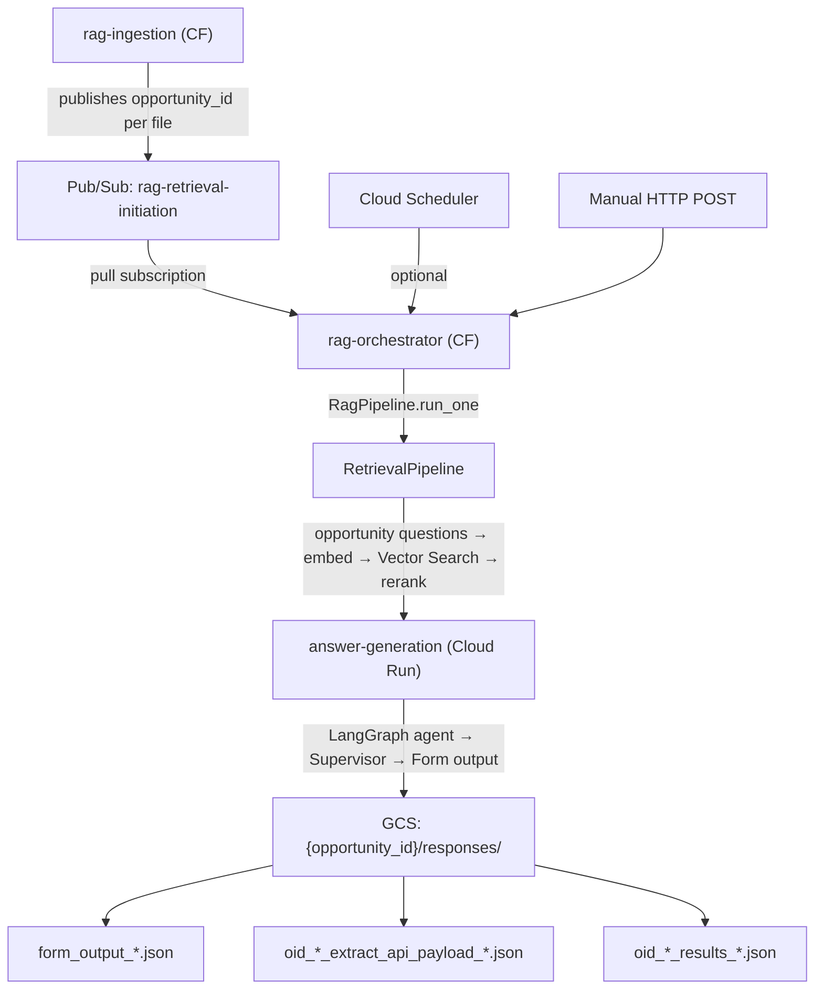

# Answer Generation & RAG Orchestrator — Post-Ingestion Deployment Runbook

Comprehensive guide for deploying and operating the **answer-generation** (Cloud Run) and **rag-orchestrator** (Cloud Function) services. These components run **after** the ingestion pipeline completes: they perform retrieval from Vertex AI Vector Search, run the LangGraph agent to extract answers, and write form outputs to GCS.

> **Prerequisite:** The [ingestion pipeline](ingestion-pipeline-deployment.md) must be deployed first. Vector Search indexes must exist and contain ingested data.

---

## 1. Architecture Overview



**Key components:**

| Component | Type | Role |
|-----------|------|------|
| **rag-orchestrator** | Cloud Function (Gen2, HTTP) | Entry point. Single-opp mode: POST `{opportunity_id}`. Batch mode: pulls from Pub/Sub, runs RagPipeline per message. |
| **answer-generation** | Cloud Run | Runs retrieval output → LangGraph agent → form JSON. Called by rag-orchestrator via HTTP. |
| **RagPipeline** | In-process | RetrievalPipeline + HTTP call to answer-generation. |
| **RetrievalPipeline** | In-process | opportunity questions → embed → Vector Search → rerank → answer items. |
| **AnswerGenerationPipeline** | In-process | Retrievals → LangGraph agent → answers + GCS writes. |

---

## 2. Prerequisites

### 2a. Ingestion Pipeline Complete

- [ ] GCS bucket `${PROJECT_ID}-ingestion` exists with `raw/` and `processed/` content
- [ ] Pub/Sub topic `rag-retrieval-initiation` exists (created in ingestion runbook)
- [ ] Vertex AI Vector Search indexes created, deployed, and populated (documents, slack, zoom)
- [ ] At least one opportunity has ingested data in the indexes

### 2b. GCP CLI and Project

```bash
gcloud auth login
gcloud auth application-default login
export PROJECT_ID=your-project-id
export REGION=us-central1
gcloud config set project $PROJECT_ID
```

### 2c. Service Account

Use the same `pzf-app@${PROJECT_ID}.iam.gserviceaccount.com` as the ingestion pipeline. It needs:

- `roles/storage.objectAdmin` (GCS read/write)
- `roles/aiplatform.user` (Vertex AI, Discovery Engine)
- `roles/run.invoker` (invoke answer-generation)
- `roles/pubsub.subscriber` (pull from rag-retrieval-initiation)
- `roles/cloudsql.client` (if using Cloud SQL for PostgreSQL)

### 2d. Cloud SQL (PostgreSQL)

The retrieval pipeline and agent load opportunity questions and field metadata from PostgreSQL. Required tables:

- `sase_batches` — batch definitions
- `sase_questions` — question text, q_id
- `sase_picklist_options` — picklist values

Ensure Cloud SQL is reachable and the service account has access. See [Database setup](#6-database--cloud-sql) below.

### 2e. Vertex AI Discovery Engine (Reranking)

Retrieval uses the Discovery Engine ranking API for semantic reranking. Ensure:

- Discovery Engine API is enabled: `gcloud services enable discoveryengine.googleapis.com --project=$PROJECT_ID`
- A ranking config exists (e.g. `default_ranking_config` in `global`). If using a custom config, create it in the [Discovery Engine console](https://console.cloud.google.com/gen-app-builder/engines) or via API.

---

## 3. Pub/Sub: Pull Subscription for rag-retrieval-initiation

The rag-orchestrator can run in **batch polling mode**: it pulls messages from a subscription on `rag-retrieval-initiation`. Each message contains `{"opportunity_id": "..."}` (or a plain string).

Create a **pull** subscription (no push endpoint):

```bash
gcloud pubsub subscriptions create rag-retrieval-initiation-sub \
  --topic=rag-retrieval-initiation \
  --project=$PROJECT_ID \
  --ack-deadline=600
```

> **Note:** `rag-ingestion` publishes one message per ingested file. Multiple files for the same opportunity produce multiple messages. The rag-orchestrator deduplicates by `opportunity_id` before processing but ACKs each message after a successful run.

Set this subscription name when deploying rag-orchestrator:

```bash
export PUBSUB_SUBSCRIPTION_RETRIEVAL_INITIATION=rag-retrieval-initiation-sub
```

---

## 4. Vector Search Retrieval Configuration

Retrieval queries deployed index endpoints (not the raw indexes). Each source needs:

- `public_domain` — base URL for findNeighbors (e.g. `https://{id}.us-central1-{project}.vdb.vertexai.goog`)
- `index_endpoint` — full endpoint resource name
- `deployed_index_id` — ID used when deploying the index

**Option A: Set VECTOR_SOURCES explicitly**

```bash
# Get index endpoint details
gcloud ai index-endpoints list --region=$REGION --project=$PROJECT_ID
gcloud ai index-endpoints describe $INDEX_ENDPOINT_ID --region=$REGION --project=$PROJECT_ID
```

Build a JSON array (one object per source: drive, slack, zoom):

```json
[
  {"name":"drive","public_domain":"https://XXX.us-central1-YYY.vdb.vertexai.goog","index_endpoint":"projects/PROJECT/locations/us-central1/indexEndpoints/ENDPOINT_ID","deployed_index_id":"ingest_docs_rag"},
  {"name":"slack","public_domain":"...","index_endpoint":"...","deployed_index_id":"ingest_slack_rag"},
  {"name":"zoom","public_domain":"...","index_endpoint":"...","deployed_index_id":"ingest_zoom_rag"}
]
```

Escape for `--set-env-vars` or store in Secret Manager. The ingestion runbook deploys indexes with IDs like `ingest_docs_rag`, `ingest_slack_rag`, `ingest_zoom_rag` — use the same deployed IDs for retrieval.

**Option B: Per-source env vars**

Set `VECTOR_SOURCE_{DRIVE,ZOOM,SLACK}_PUBLIC_DOMAIN`, `_INDEX_ENDPOINT`, and `_DEPLOYED_INDEX_ID` (9 vars total). These are read by `vector_search.get_sources()`. Store in `configs/secrets/.env` for local runs; for Cloud Run / Cloud Functions, pass via `--set-env-vars` or Secret Manager.

---

## 5. Deploy answer-generation (Cloud Run)

### 5a. Build and Deploy

From the project root:

```bash
export PROJECT_ID=your-project-id
export REGION=us-central1

# Get Cloud SQL connection name (format: project:region:instance)
export CLOUDSQL_INSTANCE_CONNECTION_NAME="${PROJECT_ID}:${REGION}:your-instance-name"

gcloud run deploy answer-generation \
  --source=. \
  --region=$REGION \
  --project=$PROJECT_ID \
  --platform=managed \
  --no-allow-unauthenticated \
  --memory=2Gi \
  --timeout=540 \
  --min-instances=1 \
  --max-instances=10 \
  --set-env-vars="\
GCP_PROJECT_ID=$PROJECT_ID,\
GCS_BUCKET_INGESTION=$PROJECT_ID-ingestion,\
VERTEX_AI_LOCATION=$REGION,\
LLM_MODEL_NAME=gemini-2.5-flash,\
CLOUDSQL_INSTANCE_CONNECTION_NAME=$CLOUDSQL_INSTANCE_CONNECTION_NAME,\
CLOUDSQL_USE_IAM_AUTH=false,\
PG_USER=your_db_user,\
PG_PASSWORD=your_db_password,\
PG_DATABASE=your_db_name" \
  --service-account=pzf-app@$PROJECT_ID.iam.gserviceaccount.com
```

> **Production:** Store `PG_PASSWORD` in Secret Manager and use `--set-secrets` instead of `--set-env-vars`.

### 5b. Cold Start Options

| Flag | Effect | Cost |
|------|--------|------|
| `--min-instances=1` | No cold start (instance always warm) | ~$50–100/mo idle |
| `--min-instances=0` | Cold start on first request | Pay only when used |

### 5c. Optional Agent Env Vars

| Variable | Default | Description |
|----------|---------|-------------|
| `AGENT_MAX_RECALL_ROUNDS` | 2 | Max recall rounds when conflicts detected |
| `AGENT_LOW_CONFIDENCE_THRESHOLD` | 0.5 | Confidence below this triggers conflict |
| `AGENT_FORM_ID_PREFIX` | SASE_FORM | Prefix for form_id (e.g. SASE_FORM_OPP_001) |
| `AGENT_USE_CACHE` | true | Use CachedContent for system prompt (faster) |

### 5d. Get the Service URL

```bash
gcloud run services describe answer-generation \
  --region=$REGION \
  --project=$PROJECT_ID \
  --format='value(status.url)'
```

Append `/answer-generation` for the full endpoint, e.g. `https://answer-generation-xxx.run.app/answer-generation`. Set `ANSWER_GENERATION_URL` when deploying rag-orchestrator.

---

## 6. Database (Cloud SQL)

The agent and retrieval pipeline require PostgreSQL with `sase_batches`, `sase_questions`, and `sase_picklist_options` tables.

> **Setup:** See [DATABASE_SETUP.md](./DATABASE_SETUP.md) for Cloud SQL instance creation and data restore. Use `data/cloud_sql_export.sql` to populate SASE tables.

**Connection variables:**

| Variable | Description |
|----------|-------------|
| `CLOUDSQL_INSTANCE_CONNECTION_NAME` | Format `project:region:instance` |
| `CLOUDSQL_USE_IAM_AUTH` | `true` or `false` |
| `PG_USER`, `PG_PASSWORD`, `PG_DATABASE` | Required when IAM auth is false |

---

## 7. Deploy rag-orchestrator (Cloud Function)

### 7a. Deploy Command

From the project root. Replace `ANSWER_GENERATION_URL` with the URL from Step 5d. Add the 9 `VECTOR_SOURCE_*` vars (see Section 4) or `VECTOR_SOURCES` JSON. For a new project, export them from `configs/secrets/.env` or set inline.

```bash
export ANSWER_GEN_URL="https://answer-generation-xxx.run.app/answer-generation"

# Export VECTOR_SOURCE_* vars before deploy (e.g. from configs/secrets/.env)

gcloud functions deploy rag-orchestrator \
  --gen2 \
  --region=$REGION \
  --runtime=python313 \
  --trigger-http \
  --entry-point=handle_http \
  --source=. \
  --project=$PROJECT_ID \
  --service-account=pzf-app@${PROJECT_ID}.iam.gserviceaccount.com \
  --set-env-vars="\
GCP_PROJECT_ID=$PROJECT_ID,\
GCS_BUCKET_INGESTION=$PROJECT_ID-ingestion,\
VERTEX_AI_LOCATION=$REGION,\
K_PER_SOURCE=5,\
K_FINAL=3,\
RANK_LOCATION=global,\
RANKING_CONFIG_ID=default_ranking_config,\
RANK_MODEL=semantic-ranker-512@latest,\
ANSWER_GENERATION_URL=$ANSWER_GEN_URL,\
PUBSUB_SUBSCRIPTION_RETRIEVAL_INITIATION=rag-retrieval-initiation-sub,\
RETRIEVAL_BATCH_SIZE=5,\
VECTOR_SOURCE_DRIVE_PUBLIC_DOMAIN=$VECTOR_SOURCE_DRIVE_PUBLIC_DOMAIN,\
VECTOR_SOURCE_DRIVE_INDEX_ENDPOINT=$VECTOR_SOURCE_DRIVE_INDEX_ENDPOINT,\
VECTOR_SOURCE_DRIVE_DEPLOYED_INDEX_ID=$VECTOR_SOURCE_DRIVE_DEPLOYED_INDEX_ID,\
VECTOR_SOURCE_ZOOM_PUBLIC_DOMAIN=$VECTOR_SOURCE_ZOOM_PUBLIC_DOMAIN,\
VECTOR_SOURCE_ZOOM_INDEX_ENDPOINT=$VECTOR_SOURCE_ZOOM_INDEX_ENDPOINT,\
VECTOR_SOURCE_ZOOM_DEPLOYED_INDEX_ID=$VECTOR_SOURCE_ZOOM_DEPLOYED_INDEX_ID,\
VECTOR_SOURCE_SLACK_PUBLIC_DOMAIN=$VECTOR_SOURCE_SLACK_PUBLIC_DOMAIN,\
VECTOR_SOURCE_SLACK_INDEX_ENDPOINT=$VECTOR_SOURCE_SLACK_INDEX_ENDPOINT,\
VECTOR_SOURCE_SLACK_DEPLOYED_INDEX_ID=$VECTOR_SOURCE_SLACK_DEPLOYED_INDEX_ID,\
PYTHONPATH=/workspace,\
FUNCTION_SOURCE=functions/rag_orchestrator.py" \
  --timeout=540 \
  --memory=1GiB \
  --no-allow-unauthenticated
```

> **Note:** Ensure `VECTOR_SOURCE_*` vars are exported before running (e.g. from `configs/secrets/.env`). Or use `VECTOR_SOURCES` (JSON) instead. For production, use Secret Manager.

### 7b. Retrieval Env Vars

| Variable | Default | Description |
|----------|--------|-------------|
| `VECTOR_SOURCE_{DRIVE,ZOOM,SLACK}_PUBLIC_DOMAIN` | — | Base URL for Vector Search findNeighbors |
| `VECTOR_SOURCE_{DRIVE,ZOOM,SLACK}_INDEX_ENDPOINT` | — | Full index endpoint resource name |
| `VECTOR_SOURCE_{DRIVE,ZOOM,SLACK}_DEPLOYED_INDEX_ID` | — | Deployed index ID (e.g. `rag_gdrive_http_XXX`) |
| `VECTOR_SOURCES` | — | JSON array; alternative to per-source vars |
| `K_PER_SOURCE` | 5 | Candidates per Vector Search source before rerank |
| `K_FINAL` | 3 | Final chunks per question after rerank |
| `RANK_LOCATION` | global | Discovery Engine ranking location |
| `RANKING_CONFIG_ID` | default_ranking_config | Ranking config name |
| `RANK_MODEL` | semantic-ranker-512@latest | Semantic ranker model |
| `PUBSUB_SUBSCRIPTION_RETRIEVAL_INITIATION` | — | **Required for batch mode** |
| `RETRIEVAL_BATCH_SIZE` | 5 | Max messages to pull per batch poll |

---

## 8. IAM: rag-orchestrator → answer-generation

The rag-orchestrator Cloud Function runs as `pzf-app@${PROJECT_ID}.iam.gserviceaccount.com`. It must have `roles/run.invoker` on the answer-generation Cloud Run service:

```bash
gcloud run services add-iam-policy-binding answer-generation \
  --region=$REGION \
  --project=$PROJECT_ID \
  --member="serviceAccount:pzf-app@${PROJECT_ID}.iam.gserviceaccount.com" \
  --role="roles/run.invoker"
```

---

## 9. Cloud Scheduler (Batch Polling)

To trigger rag-orchestrator on a schedule (e.g. every 5 minutes) to process messages from `rag-retrieval-initiation`:

```bash
RAG_ORCH_URL=$(gcloud run services describe rag-orchestrator \
  --region=$REGION --project=$PROJECT_ID --format='value(status.url)')

gcloud scheduler jobs create http rag-orchestrator-poll \
  --schedule="*/5 * * * *" \
  --location=$REGION \
  --uri="$RAG_ORCH_URL" \
  --http-method=POST \
  --message-body='{}' \
  --oauth-service-account-email="pzf-app@${PROJECT_ID}.iam.gserviceaccount.com" \
  --project=$PROJECT_ID
```

Empty body `{}` triggers **batch polling mode** (pull from Pub/Sub). To process a single opportunity on schedule, use:

```bash
--message-body='{"opportunity_id": "oid1023"}'
```

---

## 10. Populate the Database

The retrieval pipeline and agent require PostgreSQL tables `sase_batches`, `sase_questions`, and `sase_picklist_options`.

> **Full instructions:** See [DATABASE_SETUP.md](./DATABASE_SETUP.md) for all setup options (interactive, non-interactive, local restore, GCS restore).

**Quick start:**

```bash
# Interactive setup (prompts for project, password, etc.)
uv run python -m scripts.setup_database

# Or restore SASE data to existing instance
uv run python -m scripts.setup_cloudsql_and_restore \
  --no-create-instance \
  --dump-file data/cloud_sql_export.sql
```

**Verify:**

```bash
# Check SASE tables have data
psql -h 127.0.0.1 -p 5434 -U postgres -d postgres -c "SELECT COUNT(*) FROM sase_questions;"
```

The agent will fail if `sase_batches`, `sase_questions`, or `sase_picklist_options` are empty.

---

## 11. Triggering the Pipeline

### 11a. Single Opportunity (HTTP)

```bash
TOKEN=$(gcloud auth print-identity-token)
RAG_ORCH_URL=$(gcloud run services describe rag-orchestrator \
  --region=$REGION --project=$PROJECT_ID --format='value(status.url)')

curl -X POST "$RAG_ORCH_URL" \
  -H "Authorization: Bearer $TOKEN" \
  -H "Content-Type: application/json" \
  -d '{"opportunity_id": "oid7890"}'
```

### 11b. Batch Polling (Pull from Pub/Sub)

```bash
curl -X POST "$RAG_ORCH_URL" \
  -H "Authorization: Bearer $TOKEN" \
  -H "Content-Type: application/json" \
  -d '{}'
```

Returns JSON like:

```json
{
  "status": "done",
  "pulled": 3,
  "unique_opp_ids": 2,
  "failed_opp_ids": [],
  "acked_messages": 3
}
```

---

## 12. GCS Output Paths

After a successful run, the answer-generation service writes to the ingestion bucket:

| Path | Description |
|------|-------------|
| `{opportunity_id}/responses/form_output_{timestamp}.json` | BRD §18 form JSON (form_id, answers) |
| `{opportunity_id}/responses/oid_<sanitized_opp_id>_extract_api_payload_{timestamp}.json` | Payload for /api/ai/extract |
| `{opportunity_id}/responses/oid_<sanitized_opp_id>_results_{timestamp}.json` | Full result with _meta and answers |

---

## 13. Environment Variable Reference

### answer-generation (Cloud Run)

| Variable | Required | Description |
|----------|----------|-------------|
| `GCP_PROJECT_ID` | Yes | GCP project ID |
| `GCS_BUCKET_INGESTION` | Yes | Bucket for form outputs |
| `VERTEX_AI_LOCATION` | Yes | Region (e.g. us-central1) |
| `LLM_MODEL_NAME` | Yes | Gemini model (e.g. gemini-2.5-flash) |
| `CLOUDSQL_INSTANCE_CONNECTION_NAME` | Yes | project:region:instance |
| `CLOUDSQL_USE_IAM_AUTH` | Yes | true/false |
| `PG_USER`, `PG_PASSWORD`, `PG_DATABASE` | If IAM=false | DB credentials |
| `AGENT_MAX_RECALL_ROUNDS` | No | Default 2 |
| `AGENT_LOW_CONFIDENCE_THRESHOLD` | No | Default 0.5 |
| `AGENT_FORM_ID_PREFIX` | No | Default SASE_FORM |

### rag-orchestrator (Cloud Function)

| Variable | Required | Description |
|----------|----------|-------------|
| `GCP_PROJECT_ID` | Yes | GCP project ID |
| `GCS_BUCKET_INGESTION` | Yes | Bucket for retrieval context |
| `VERTEX_AI_LOCATION` | Yes | Region |
| `ANSWER_GENERATION_URL` | Yes | Full URL including /answer-generation |
| `PUBSUB_SUBSCRIPTION_RETRIEVAL_INITIATION` | For batch mode | Pull subscription name |
| `VECTOR_SOURCE_DRIVE_PUBLIC_DOMAIN`, `_INDEX_ENDPOINT`, `_DEPLOYED_INDEX_ID` | Yes* | Vector Search for Drive (or use `VECTOR_SOURCES`) |
| `VECTOR_SOURCE_ZOOM_*`, `VECTOR_SOURCE_SLACK_*` | Yes* | Same for Zoom, Slack |
| `K_PER_SOURCE`, `K_FINAL` | No | Retrieval params |
| `RANK_LOCATION`, `RANKING_CONFIG_ID`, `RANK_MODEL` | No | Reranking config |
| `VECTOR_SOURCES` | No | JSON; overrides per-source vars |
| `RETRIEVAL_BATCH_SIZE` | No | Default 5 |
| `PYTHONPATH` | Yes | Must be `/workspace` |

---

## 14. Local Testing

### 14a. answer-generation Only

```bash
uv run uvicorn main:app --reload --port 8080
```

```bash
curl -X POST http://localhost:8080/answer-generation \
  -H "Content-Type: application/json" \
  -d '{"opportunity_id": "test", "retrievals": {}}'
```

Requires `configs/.env` and `configs/secrets/.env` with DB and GCP settings.

### 14b. Full Pipeline (Retrieval + Agent)

```bash
uv run python -m scripts.run_agent_local oid1023
```

Runs RetrievalPipeline + agent locally. Use `--mock` for mock retrievals without Vector Search.

```bash
uv run python -m scripts.run_agent_local --mock
```

---

## 15. Troubleshooting

### 15a. answer-generation returns 500

- Check Cloud Run logs: `gcloud run services logs read answer-generation --region=$REGION`
- Verify DB connection (Cloud SQL Proxy, IAM, credentials)
- Ensure `GCS_BUCKET_INGESTION` is writable by the service account

### 15b. rag-orchestrator: "ANSWER_GENERATION_URL not set"

- Set `ANSWER_GENERATION_URL` in the function's env vars and redeploy

### 15c. rag-orchestrator: 403 when calling answer-generation

- Run the IAM binding in Step 8
- Ensure `pzf-app` has `roles/run.invoker` on the answer-generation service

### 15d. Retrieval returns empty

- Verify `opportunity_id` exists in Vector Search (ingestion uses it as restrict)
- Check `VECTOR_SOURCES` (JSON) and deployed index IDs match ingestion
- Ensure opportunity questions exist in `sase_questions`

### 15e. Discovery Engine ranking fails

- Enable `discoveryengine.googleapis.com`
- Verify `RANKING_CONFIG_ID` exists in `RANK_LOCATION`
- Check service account has `roles/aiplatform.user` or Discovery Engine roles

### 15f. Batch polling: "PUBSUB_SUBSCRIPTION_RETRIEVAL_INITIATION not set"

- Set the env var to the pull subscription name (e.g. `rag-retrieval-initiation-sub`)

---

## 16. Post-Deployment Checklist

- [ ] Pub/Sub pull subscription `rag-retrieval-initiation-sub` created
- [ ] Cloud SQL accessible; `sase_batches`, `sase_questions`, `sase_picklist_options` populated (via Step 10)
- [ ] answer-generation Cloud Run deployed and healthy
- [ ] rag-orchestrator Cloud Function deployed
- [ ] IAM: pzf-app has `roles/run.invoker` on answer-generation
- [ ] `ANSWER_GENERATION_URL` set correctly in rag-orchestrator
- [ ] `PUBSUB_SUBSCRIPTION_RETRIEVAL_INITIATION` set (if using batch mode)
- [ ] Cloud Scheduler job created (if using scheduled batch polling)
- [ ] Single-opp curl test passes
- [ ] GCS outputs appear under `{opportunity_id}/responses/`
