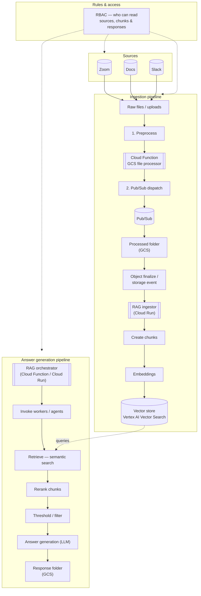

# RAG ingestion & answer generation — architecture flowchart

High-level flow: sources → preprocess → Pub/Sub → processed storage → RAG ingestor → chunks / embeddings → vector store; separate path from orchestrator through retrieval, rerank, threshold, LLM, to response artifacts in GCS.

## How to view

- Paste the diagram into [Mermaid Live Editor](https://mermaid.live), or open this file in an editor / docs site that renders Mermaid (GitHub, many IDEs).
