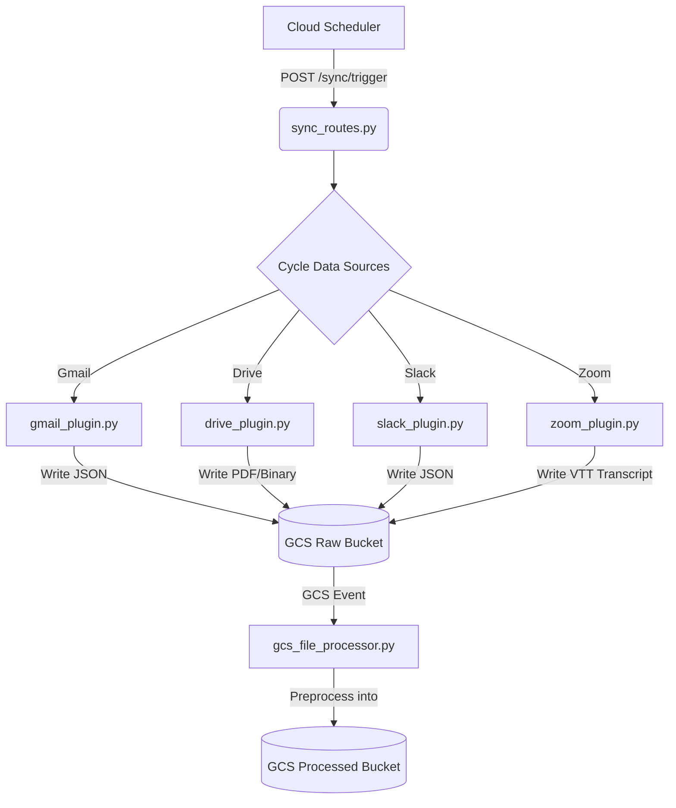

# Plugin Integrations Walkthrough

This document highlights the work successfully completed to migrate the Knowledge-Assist application towards a generalized architecture, incorporating active plugins for Google Drive, Gmail, Slack, and Zoom using proper OAuth flows.

## What Was Accomplished

### 1. Unified Authentication Architecture
- **[NEW] `src/services/database_manager/orm.py`**: Enabled proper SQLAlchemy connection handling using the Google Cloud SQL Connector (pg8000) for GCP environments and psycopg2 for local testing.
- **[NEW] `src/services/database_manager/models/auth_models.py`**: Defined structured generalized tables (`User`, `Opportunity`, `OpportunitySource`) allowing us to store arbitrary users alongside their OAuth credentials (`google_refresh_token`, `slack_access_token`) and synchronization checkpoints.
- **[NEW] `src/apis/routes/auth_routes.py`**: Added two fully functional OAuth 2.0 callback handlers designed specifically for a detached frontend logic (`/auth/google/url`, `/auth/google/callback`, `/auth/slack/url`, `/auth/slack/callback`).

### 2. Active Sync Plugins
Instead of expecting humans to drop files into GCS, four custom backend services were constructed to securely read data from the APIs and automatically place the output into the `raw/` tier format that `gcs_file_processor.py` seamlessly picks up.

#### Drive Plugin
- Connects using the authenticated user's `google_refresh_token`.
- Matches the opportunity by searching for precisely named folders.
- Walks the hierarchy using `modifiedTime` checkpoints to **skip files that have not changed**, re-exporting only updated Documents/Presentations as raw PDFs.

#### Gmail Plugin
- Connects using the user's `google_refresh_token`.
- Uses a `subject:"<oid>" after:YYYY/MM/DD` search pattern to rapidly pinpoint target opportunity threads.
- Extracts, normalizes `base64` bodies, strips HTML into plain text context, and pushes atomic JSON packets.

#### Slack Plugin
- Links user-level bot tokens (`channels:history`, `channels:read`).
- Dynamically iterates over all matched Slack Channels starting with the OID (e.g., `oid1023-*`).
- Uses high-performance incremental cursor scraping via `oldest=timestamp`, including tracking threading structures into unified generic JSON payloads that are synced continuously into `raw/`.

#### Zoom Plugin
- Designed cleanly via **Server-to-Server OAuth (S2S)** to authenticate headless requests against the `zoom.us/oauth/token` route.
- Interrogates completed meetings assigned to the user, downloading attached `.VTT` transcript text streams matching the opportunity directly into GCS.

### 3. Sync Orchestration (The Scheduler)
- **[NEW] `src/apis/routes/sync_routes.py`**: Added a generalized `/sync/trigger` endpoint. 
- Designed perfectly to be tied to a standard GCP Cloud Scheduler (CRON). 
- Every invocation cycles across all configured opportunities in the database, evaluating checkpoints, and firing the necessary plugins silently via FastApi `BackgroundTasks`.

---

## Technical Flow Overview

> [!TIP]
> You can now point your Cloud Scheduler to trigger `POST /sync/trigger` every 30 minutes, allowing Knowledge-Assist to remain fully unified with user communications across platforms incrementally!
